# GCP-Lab-Multimodality-with-Gemini
GCP Lab of Multimodality with Gemini

## Overview
This lab introduces you to Gemini, a family of multimodal generative AI models developed by Google. You'll use the Gemini API to explore how Gemini Flash can understand and generate responses based on text, images, and video.

### Gemini's multimodal capabilities enable it to:

Analyze images: Detect objects, understand user interfaces, interpret diagrams, and compare visual similarities and differences.
Process videos: Generate descriptions, extract tags and highlights, and answer questions about video content.
You'll experiment with these features through hands-on tasks using the Gemini API in Vertex AI.

#### Prerequisites
Before starting this lab, you should be familiar with:
#### Basic Python programming.
General API concepts.
Running Python code in a Jupyter notebook on Vertex AI Workbench.

#### Objectives
In this lab, you will:

Interact with the Gemini API in Vertex AI.
Use the Gemini Flash model to analyze images and videos.
Provide Gemini with text, image, and video prompts to generate informative responses.
Explore practical applications of Gemini's multimodal capabilities.


### Task 1. Open the notebook in Vertex AI Workbench
In the Google Cloud console, on the Navigation menu (Navigation menu icon), click Vertex AI > Workbench.

Find the generative-ai-jupyterlab instance and click on the Open JupyterLab button.

The JupyterLab interface for your Workbench instance opens in a new browser tab.

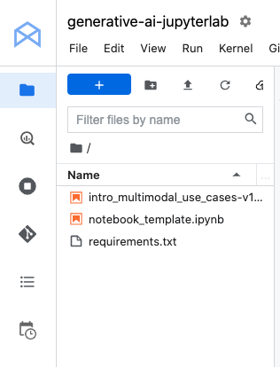

### Task 2. Set up the notebook
Open the intro_multimodal_use_cases file.

In the Select Kernel dialog, choose Python 3 from the list of available kernels.

Run through the Getting Started and the Import libraries sections of the notebook.

For Project ID, use qwiklabs-gcp-01-8ded61dc073e, and for Location, use us-east1.

>Note: You can skip any notebook cells that are noted Colab only. If you experience a 429 response from any of the notebook cell executions, wait 1 minute before running the cell again to proceed.

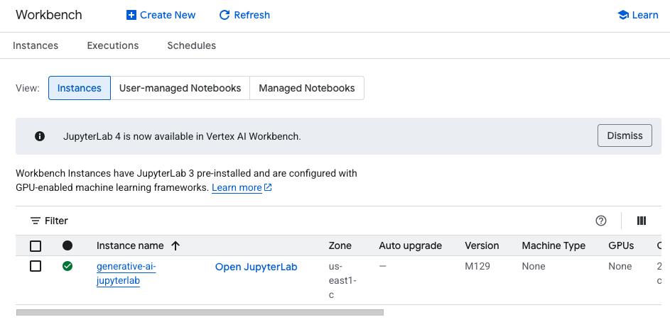

## Getting Started

#### Install Vertex AI SDK for Python
`%pip install --upgrade --user google-cloud-aiplatform`

Restart current runtime
To use the newly installed packages in this Jupyter runtime, you must restart the runtime. You can do this by running the cell below, which will restart the current kernel.

```
# Restart kernel after installs so that your environment can access the new packages
import IPython

app = IPython.Application.instance()
app.kernel.do_shutdown(True)
```

```
# Define project information
PROJECT_ID = "qwiklabs-gcp-01-8ded61dc073e"  # @param {type:"string"}
LOCATION = "us-east1"  # @param {type:"string"}

# Initialize Vertex AI
import vertexai

vertexai.init(project=PROJECT_ID, location=LOCATION)
```

Import libraries

```
from vertexai.generative_models import GenerationConfig, GenerativeModel, Image, Part
```

## Use the Gemini 2.0 Flash model

Gemini 2.0 Flash (`gemini-2.0-flash`) is a multimodal model that supports multimodal prompts. You can include text, image(s), and video in your prompt requests and get text or code responses.


Load Gemini 2.0 Flash model

`multimodal_model = GenerativeModel("gemini-2.0-flash")`

Define helper functions¶

```
import http.client
import typing
import urllib.request

import IPython.display
from PIL import Image as PIL_Image
from PIL import ImageOps as PIL_ImageOps


def display_images(
    images: typing.Iterable[Image],
    max_width: int = 600,
    max_height: int = 350,
) -> None:
    for image in images:
        pil_image = typing.cast(PIL_Image.Image, image._pil_image)
        if pil_image.mode != "RGB":
            # RGB is supported by all Jupyter environments (e.g. RGBA is not yet)
            pil_image = pil_image.convert("RGB")
        image_width, image_height = pil_image.size
        if max_width < image_width or max_height < image_height:
            # Resize to display a smaller notebook image
            pil_image = PIL_ImageOps.contain(pil_image, (max_width, max_height))
        IPython.display.display(pil_image)


def get_image_bytes_from_url(image_url: str) -> bytes:
    with urllib.request.urlopen(image_url) as response:
        response = typing.cast(http.client.HTTPResponse, response)
        image_bytes = response.read()
    return image_bytes


def load_image_from_url(image_url: str) -> Image:
    image_bytes = get_image_bytes_from_url(image_url)
    return Image.from_bytes(image_bytes)


def display_content_as_image(content: str | Image | Part) -> bool:
    if not isinstance(content, Image):
        return False
    display_images([content])
    return True


def display_content_as_video(content: str | Image | Part) -> bool:
    if not isinstance(content, Part):
        return False
    part = typing.cast(Part, content)
    file_path = part.file_data.file_uri.removeprefix("gs://")
    video_url = f"https://storage.googleapis.com/{file_path}"
    IPython.display.display(IPython.display.Video(video_url, width=600))
    return True


def print_multimodal_prompt(contents: list[str | Image | Part]):
    """
    Given contents that would be sent to Gemini,
    output the full multimodal prompt for ease of readability.
    """
    for content in contents:
        if display_content_as_image(content):
            continue
        if display_content_as_video(content):
            continue
        print(content)
```


### Task 3. Use the Gemini Flash model
Gemini Flash is a multimodal model that supports multimodal prompts. You can include text, image(s), and video in your prompt requests and get text or code responses.

In this task, run through the notebook cells to see how to use the Gemini Flash model. Return here to check your progress as you complete the objectives.

Image understanding across multiple images
One of the capabilities of Gemini is being able to reason across multiple images. In this example, you will use Gemini to calculate the total cost of groceries using an image of fruits and a price list.

Run through the Image understanding across multiple images section of the notebook.


#### Image understanding across multiple images
One of the capabilities of Gemini is being able to reason across multiple images.

This is an example of using Gemini to calculate the total cost of groceries using an image of fruits and a price list:

```
image_grocery_url = "https://storage.googleapis.com/github-repo/img/gemini/multimodality_usecases_overview/banana-apple.jpg"
image_prices_url = "https://storage.googleapis.com/github-repo/img/gemini/multimodality_usecases_overview/pricelist.jpg"
image_grocery = load_image_from_url(image_grocery_url)
image_prices = load_image_from_url(image_prices_url)

instructions = "Instructions: Consider the following image that contains fruits:"
prompt1 = "How much should I pay for the fruits given the following price list?"
prompt2 = """
Answer the question through these steps:
Step 1: Identify what kind of fruits there are in the first image.
Step 2: Count the quantity of each fruit.
Step 3: For each grocery in first image, check the price of the grocery in the price list.
Step 4: Calculate the subtotal price for each type of fruit.
Step 5: Calculate the total price of fruits using the subtotals.

Answer and describe the steps taken:
"""

contents = [
    instructions,
    image_grocery,
    prompt1,
    image_prices,
    prompt2,
]

responses = multimodal_model.generate_content(contents, stream=True)

print("-------Prompt--------")
print_multimodal_prompt(contents)

print("\n-------Response--------")
for response in responses:
    print(response.text, end="")
```

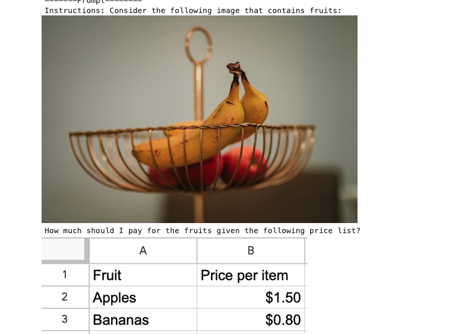
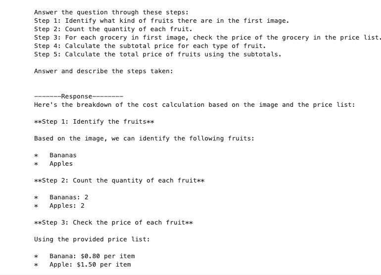


##### Understanding Screens and Interfaces
Gemini can also extract information from appliance screens, UIs, screenshots, icons, and layouts.

For example, if you input an image of a stove, you can ask Gemini to provide instructions to help a user navigate the UI and respond in different languages:

```
image_stove_url = "https://storage.googleapis.com/github-repo/img/gemini/multimodality_usecases_overview/stove.jpg"
image_stove = load_image_from_url(image_stove_url)

prompt = """Help me to reset the clock on this appliance?
Provide the instructions in English and French.
If instructions include buttons, also explain where those buttons are physically located.
"""

contents = [image_stove, prompt]

responses = multimodal_model.generate_content(contents, stream=True)

print("-------Prompt--------")
print_multimodal_prompt(contents)

print("\n-------Response--------")
for response in responses:
    print(response.text, end="")
```

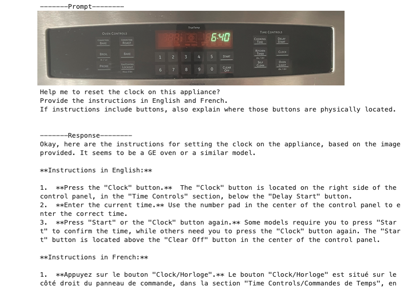


>Note: The response may not be completely accurate, as the model may hallucinate; however, the model is able to identify the location of buttons and translate in a single query. To mitigate hallucinations, one approach is to ground the LLM with retrieval-augmented generation, which is outside the scope of this notebook


#### Understanding entity relationships in technical diagrams
Gemini has multimodal capabilities that enable it to understand diagrams and take actionable steps, such as optimization or code generation. This example demonstrates how Gemini can decipher an entity relationship (ER) diagram, understand the relationships between tables, identify requirements for optimization in a specific environment like BigQuery, and even generate corresponding code.

```
image_er_url = "https://storage.googleapis.com/github-repo/img/gemini/multimodality_usecases_overview/er.png"
image_er = load_image_from_url(image_er_url)

prompt = "Document the entities and relationships in this ER diagram."

contents = [prompt, image_er]

# Use a more deterministic configuration with a low temperature
generation_config = GenerationConfig(
    temperature=0.1,
    top_p=0.8,
    top_k=40,
    candidate_count=1,
    max_output_tokens=2048,
)

responses = multimodal_model.generate_content(
    contents,
    generation_config=generation_config,
    stream=True,
)

print("-------Prompt--------")
print_multimodal_prompt(contents)

print("\n-------Response--------")
for response in responses:
    print(response.text, end="")
```

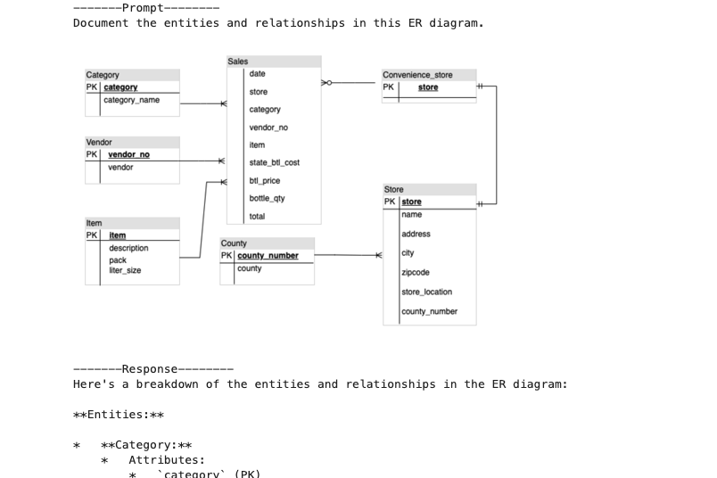
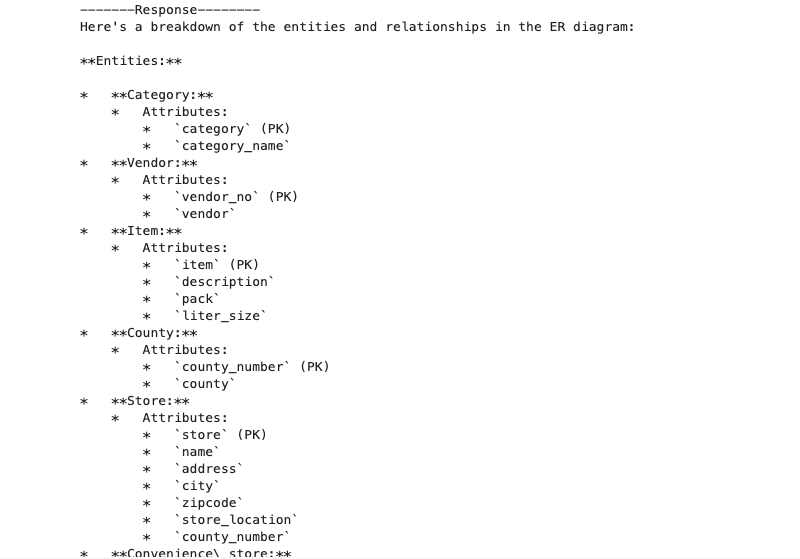
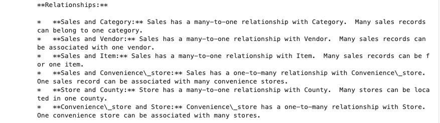


#### Recommendations based on multiple images
Gemini is capable of image comparison and providing recommendations. This may be useful in industries like e-commerce and retail.

Below is an example of choosing which pair of glasses would be better suited to an oval-shaped face:

```
image_glasses1_url = "https://storage.googleapis.com/github-repo/img/gemini/multimodality_usecases_overview/glasses1.jpg"
image_glasses2_url = "https://storage.googleapis.com/github-repo/img/gemini/multimodality_usecases_overview/glasses2.jpg"
image_glasses1 = load_image_from_url(image_glasses1_url)
image_glasses2 = load_image_from_url(image_glasses2_url)

prompt1 = """
Which of these glasses you recommend for me based on the shape of my face?
I have an oval shape face.
----
Glasses 1:
"""
prompt2 = """
----
Glasses 2:
"""
prompt3 = """
----
Explain how you reach out to this decision.
Provide your recommendation based on my face shape, and reasoning for each in JSON format.
"""

contents = [prompt1, image_glasses1, prompt2, image_glasses2, prompt3]

responses = multimodal_model.generate_content(contents, stream=True)

print("-------Prompt--------")
print_multimodal_prompt(contents)

print("\n-------Response--------")
for response in responses:
    print(response.text, end="")
```

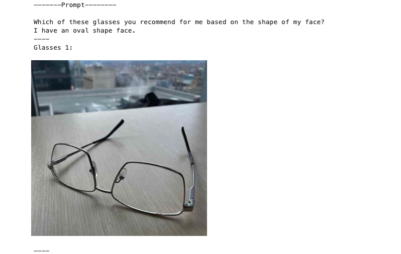
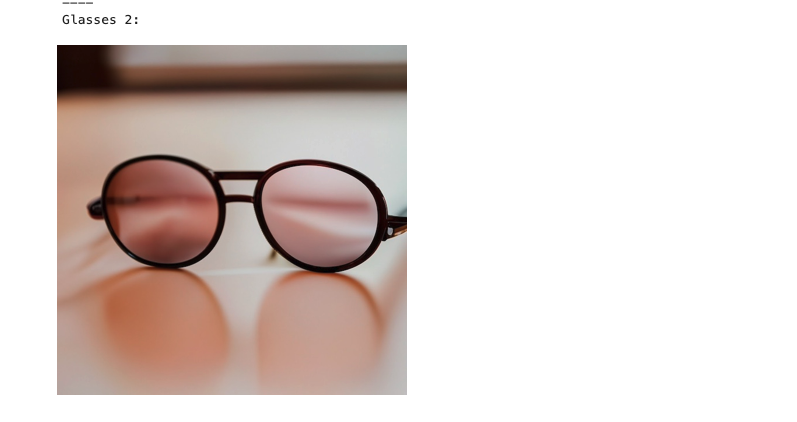
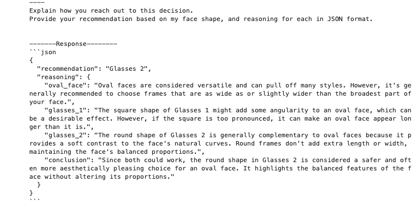


#### Similarity/Differences

Gemini can compare images and identify similarities or differences between objects.

The following example shows two scenes from Marienplatz in Munich, Germany that are slightly different. Gemini can compare between the images and find similarities/differences:


```
image_landmark1_url = "https://storage.googleapis.com/github-repo/img/gemini/multimodality_usecases_overview/landmark1.jpg"
image_landmark2_url = "https://storage.googleapis.com/github-repo/img/gemini/multimodality_usecases_overview/landmark2.jpg"
image_landmark1 = load_image_from_url(image_landmark1_url)
image_landmark2 = load_image_from_url(image_landmark2_url)

prompt1 = """
Consider the following two images:
Image 1:
"""
prompt2 = """
Image 2:
"""
prompt3 = """
1. What is shown in Image 1? Where is it?
2. What is similar between the two images?
3. What is difference between Image 1 and Image 2 in terms of the contents or people shown?
"""

contents = [prompt1, image_landmark1, prompt2, image_landmark2, prompt3]

generation_config = GenerationConfig(
    temperature=0.0,
    top_p=0.8,
    top_k=40,
    candidate_count=1,
    max_output_tokens=2048,
)

responses = multimodal_model.generate_content(
    contents,
    generation_config=generation_config,
    stream=True,
)

print("-------Prompt--------")
print_multimodal_prompt(contents)

print("\n-------Response--------")
for response in responses:
    print(response.text, end="")
```

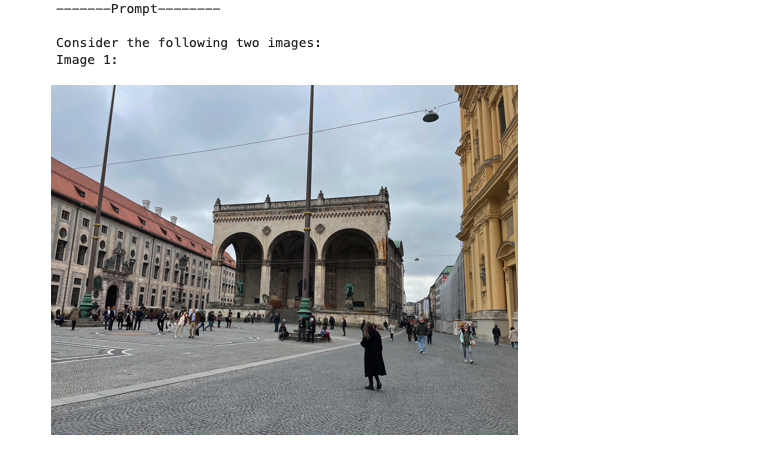
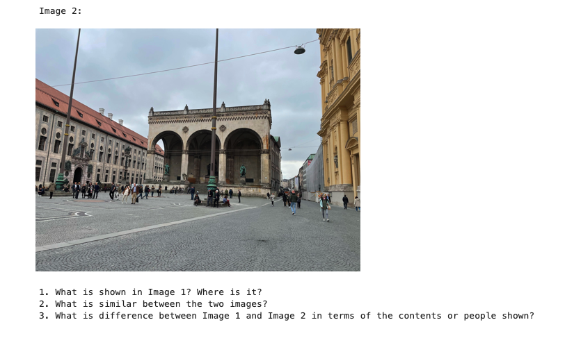
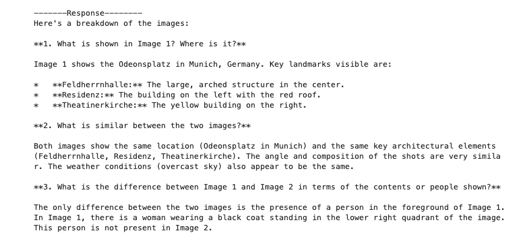


### Generating a video description
Gemini can also extract tags throughout a video:

Video: https://storage.googleapis.com/github-repo/img/gemini/multimodality_usecases_overview/mediterraneansea.mp4

```
prompt = """
What is shown in this video?
Where should I go to see it?
What are the top 5 places in the world that look like this?
"""
video = Part.from_uri(
    uri="gs://github-repo/img/gemini/multimodality_usecases_overview/mediterraneansea.mp4",
    mime_type="video/mp4",
)
contents = [prompt, video]

responses = multimodal_model.generate_content(contents, stream=True)

print("-------Prompt--------")
print_multimodal_prompt(contents)

print("\n-------Response--------")
for response in responses:
    print(response.text, end="")

```

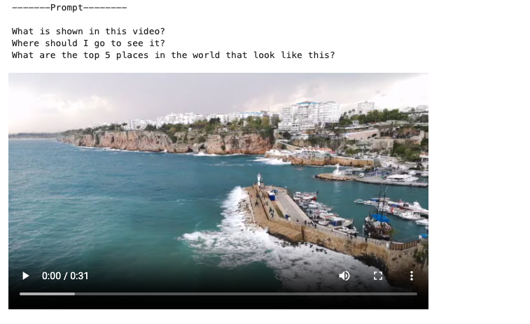
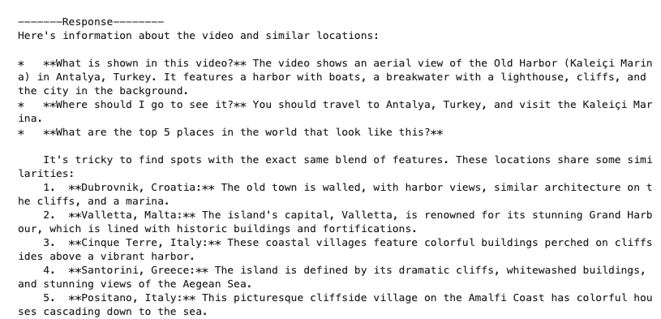


#### Extracting tags of objects throughout the video

Gemini can also extract tags throughout a video.

Video: https://storage.googleapis.com/github-repo/img/gemini/multimodality_usecases_overview/photography.mp4


```
prompt = """
Answer the following questions using the video only:
- What is in the video?
- What is the action in the video?
- Provide 10 best tags for this video?
"""
video = Part.from_uri(
    uri="gs://github-repo/img/gemini/multimodality_usecases_overview/photography.mp4",
    mime_type="video/mp4",
)
contents = [prompt, video]

responses = multimodal_model.generate_content(contents, stream=True)

print("-------Prompt--------")
print_multimodal_prompt(contents)

print("\n-------Response--------")
for response in responses:
    print(response.text, end="")
```

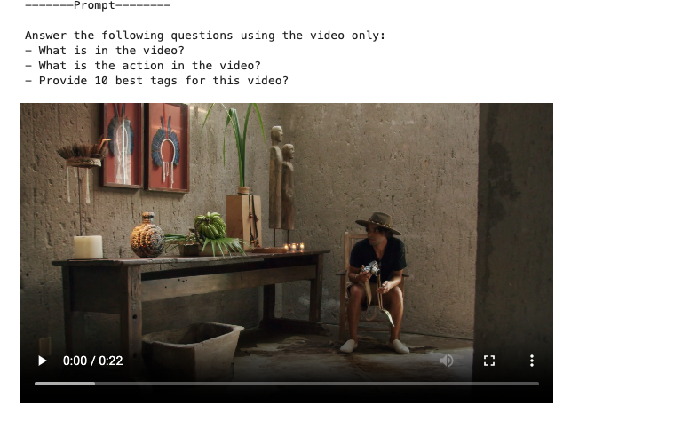
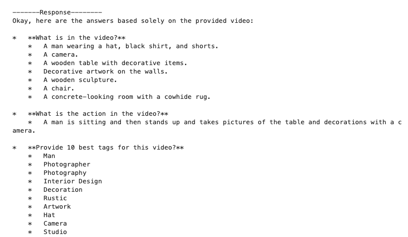


#### Asking more questions about a video
Below is another example of using Gemini to ask questions the video and return a JSON response.

Video: 
[title](https://storage.googleapis.com/github-repo/img/gemini/multimodality_usecases_overview/pixel8.mp4)
Note: Although this video contains audio, Gemini does not currently support audio input and will only answer based on the video.

```
prompt = """
Answer the following questions using the video only:
What is the profession of the main person?
What are the main features of the phone highlighted?
Which city was this recorded in?
Provide the answer JSON.
"""
video = Part.from_uri(
    uri="gs://github-repo/img/gemini/multimodality_usecases_overview/pixel8.mp4",
    mime_type="video/mp4",
)
contents = [prompt, video]

responses = multimodal_model.generate_content(contents, stream=True)

print("-------Prompt--------")
print_multimodal_prompt(contents)

print("\n-------Response--------")
for response in responses:
    print(response.text, end="")
```


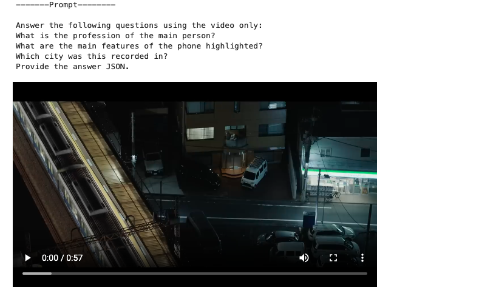
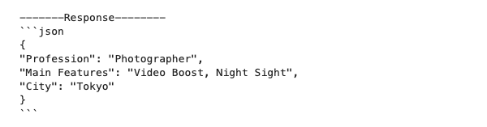


#### Retrieving extra information beyond the video
Video: 

[Ottawa Train](https://storage.googleapis.com/github-repo/img/gemini/multimodality_usecases_overview/ottawatrain3.mp4)

```
prompt = """
Which line is this?
where does it go?
What are the stations/stops of this line?
"""
video = Part.from_uri(
    uri="gs://github-repo/img/gemini/multimodality_usecases_overview/ottawatrain3.mp4",
    mime_type="video/mp4",
)
contents = [prompt, video]

responses = multimodal_model.generate_content(contents, stream=True)

print("-------Prompt--------")
print_multimodal_prompt(contents)

print("\n-------Response--------")
for response in responses:
    print(response.text, end="")
```

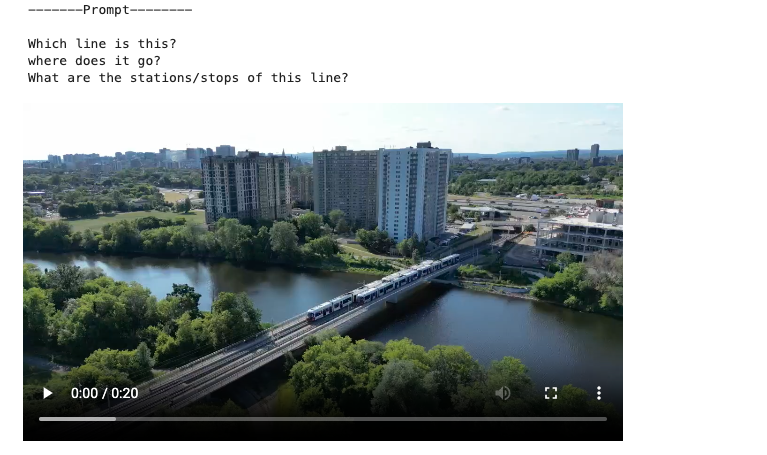
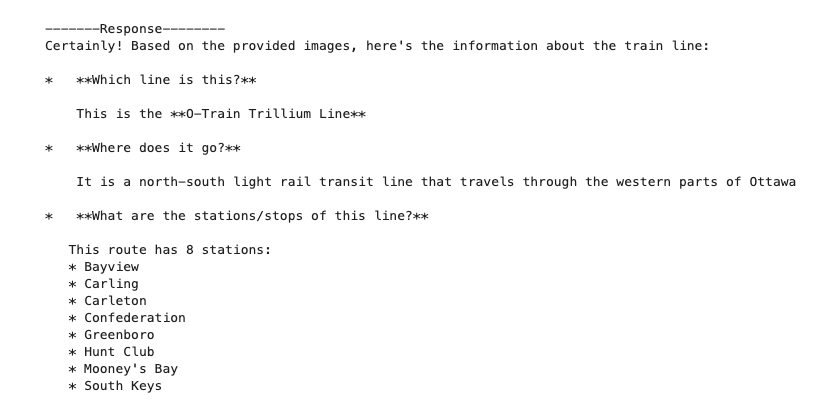


Congratulations!
You have now completed the lab! In this lab, you learned how to use the Gemini API in Vertex AI to generate text from text and image(s) prompts.

Next steps / learn more
Check out the following resources to learn more about Gemini:

Gemini Overview
Generative AI on Vertex AI Documentation
Generative AI on YouTube
Explore the Vertex AI Cookbook for a curated, searchable gallery of notebooks for Generative AI.
Explore other notebooks and samples in the Google Cloud Generative AI repository.

